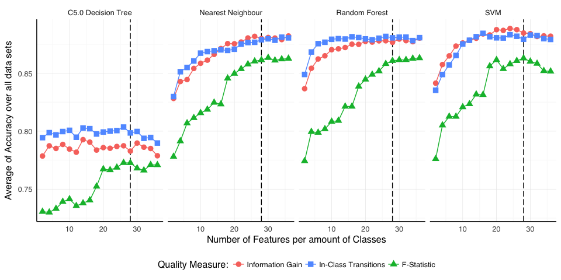
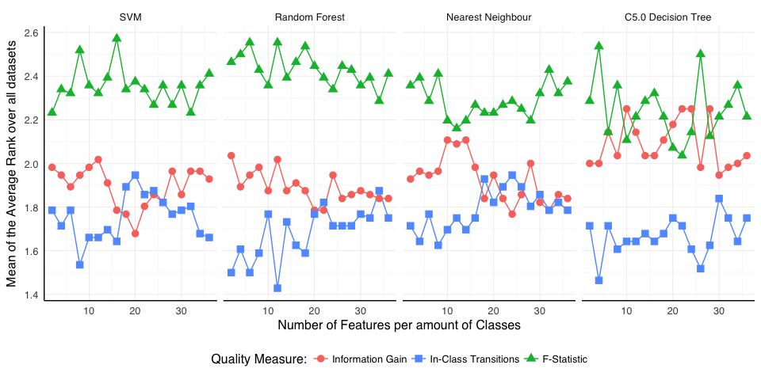
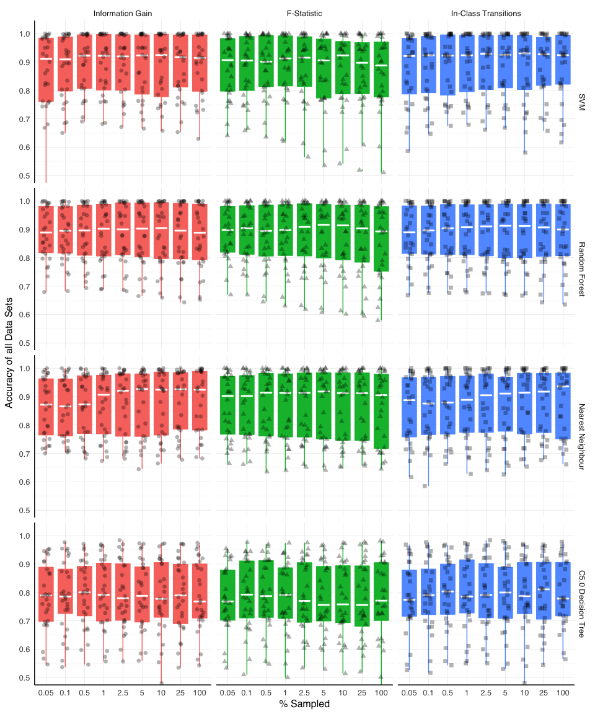
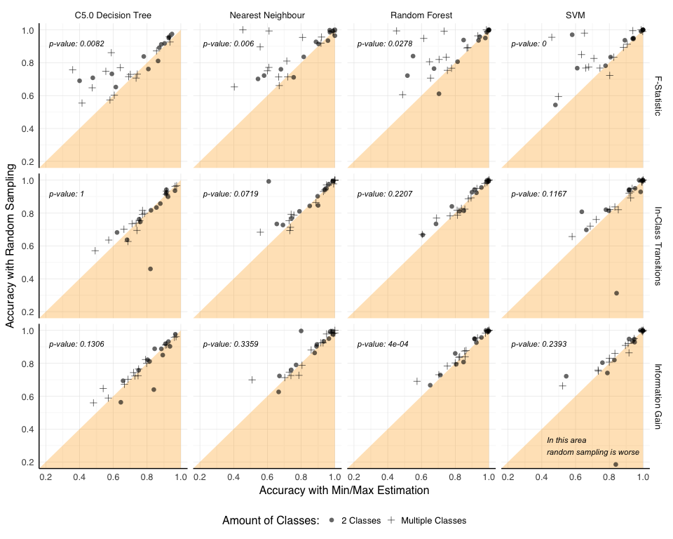
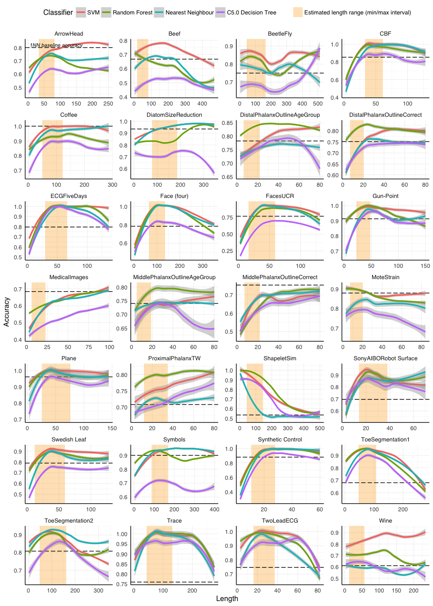
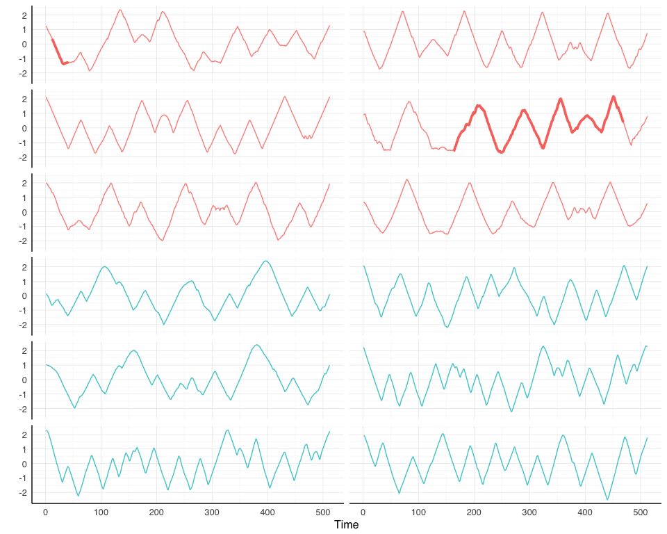

Shapelets Sampling and Quality Measures
================
Lucas Schmidt Cavalcante
December, 2016

-   [Introduction](#introduction)
    -   [Goals](#goals)
-   [Experimental Setup](#experimental-setup)
    -   [Datasets](#datasets)
    -   [Classifiers](#classifiers)
    -   [Classification Process](#classification-process)
    -   [Implementation Details](#implementation-details)
-   [Evaluation of the Quality Measures](#evaluation-of-the-quality-measures)
-   [Evaluation of the Search-Space Reduction Techniques](#evaluation-of-the-search-space-reduction-techniques)
    -   [Random Sampling](#random-sampling)
    -   [Exploration of a specific length range of the shapelets](#exploration-of-a-specific-length-range-of-the-shapelets)
        -   [Time Evaluation](#time-evaluation)
        -   [Accuracy Evaluation](#accuracy-evaluation)
-   [Length Inspection by using Random Sampling](#length-inspection-by-using-random-sampling)
    -   [BeetleFly dataset](#beetlefly-dataset)
-   [Execution Details](#execution-details)
-   [Acknowledgements](#acknowledgements)
-   [References](#references)

``` r
library(rbenchmark)

library(Rcpp)
library(RcppParallel)

library(R.matlab)

library(reshape2)
library(broom)
library(plyr)
library(tidyr)

library(foreach)
library(doParallel)

library(ggplot2)

library(caret)

library(class)
library(e1071)
library(randomForest)
library(C50)

library(knitr)
library(xtable)
```

``` r
source("./code/shapeletsRepresentation.R")
```

Introduction
============

Time series classification has been applied to many fields, and empirical evidence suggests that the simple algorithm of nearest neighbor (NN) coupled with an elastic measure, such as Dynamic Time Warping (DTW), is hard to beat in terms of accuracy \[Batista et al. 2013\]. However, this approach has the following shortcomings \[Ye and Keogh 2009\]:

-   Its results are hard to interpret;
-   It is computationally intensive, given that to classify a new instance it needs to check the whole training set;
-   If time series of different classes are distinguished by a small pattern then it tends to perform poorly, because the noise present on the whole series can dominate any difference caused by the pattern.

To address these shortcomings Ye and Keogh \[2009\] introduced a new primitive for classification called Shapelets. Shapelets are subsequences of time series that are in a sense representative of a class. Good shapelets are the ones that encompasses local patterns that are present in time series of one class but not in others. As an example, the figure below highlights time intervals that are expected to contain good shapelets.


Initially a shapelet discovery algorithm was embeded in a decision tree for classification. Such tree had one shapelet (a subsequence) at each node, and the classification resulted from measuring the distance of a new time series to said shapelet. This tree is called the shapelet decision-tree and usually achieves good accuracy \[Ye and Keogh 2009\].

However good the shapelet decision-tree is, Hills et al. \[2013\] showed that it is possible to attain better accuracy by obtaining what is called the Shapelet Transform of the data. Given a set of good shapelets, one obtains the Shapelet Tranform by describing each time series by its distance to every shapelet, thus the shapelets become attributes in a distance matrix. The breaktrough of this apporach is that this numerical matrix gets away with any temporal aspect and allows the employment of any classifier.

Hills et al. \[2013\] compared the accuracy of the shapelet decision-tree with the accuracy of complex (SVM, Random Forest, Rotation Forest and Bayesian Networks) and simple (Decision-tree, k-NN, Naive Bayes) classifiers executed over the Shapelet Transform. They found that in terms of accuracy complex classifiers tend to be more accurate than the simpler ones and the shapelet decision-tree. Moreover, they also demonstrated the accuracy equivalency of the shapelet decision-tree and a decision tree induced over the shapelet transform.

One important aspect left-out until now is how to define if a shapelet is good or not. As the shapelets were initially built inside a decision-tree they have been measured by its **information gain**. However, Lines and Bagnall \[2012\] tested some alternatives quality measures, namely the Mood's Median and the Kruskal-Wallis non-parametric test, and found that althought they dont outperform the information gain in terms of accuracy they can be about 20% faster. These findings were also explored by Hills et al. \[2013\], which also tested the **f-statistic** as a quality measure on their experiments, and found that the f-statistic was the most accurate and had the best average rank (but without significant difference). Moreover, f-statistic was the fastest measure on average and had the fastest time on most datasets. For the authors this was enough to argue that the f-statistic should be the default choice for shapelet quality. We observe that the experiments of both Lines and Bagnall \[2012\] and Hills et al. \[2013\] were done over the shapelet decision-tree, even thought the latter suggested its use over the shapelet transform.

Lastly, as the number of shapelets in a dataset is linear on the amount of time series and quadratic on their length, an exhaustive search of all shapelets can be prohibitve. Hills et al. \[2013\] proposed an algorithm to estimate the length range of good shapelets and only explored those within this range. On the other hand, Renard et al. \[2015\] proposed the use of the simple algorithm of **random sampling**. However, we note that the experiments of Renard et al. \[2015\] were also restricted on the shapelet decision-tree domain.

Goals
-----

On this work we seek to extend and re-evaluate some of the previous findings about quality measures, accuracy and sampling over the shapelet transform. First of all, we consider that it is important to have accuracy results from the whole set of shapelets to serve as baseline and to then identify any potential impact of using a subset of them:

-   The experiments of Hills et al. \[2013\] that found that it is better to use the shapelet transform in cojunction with complex classifiers used only a subset of the shapelets (those within a specfic length range determined by their algorithm). **We aim determine the accuracy of complex and simple classifiers over the shapelet transform using the full set of shapelets to serve as baseline to any further comparison**.

Secondly, we believe that any findings over the shapelet decison-tree should not be assumed to remain true over the shapelet trasnform:

-   Hills et al. \[2013\] evaluated some alternative quality measures over the shapelet decision-tree and recommended the f-statistic to be the default quality measure. **As a second goal we aim to investigate how the different quality measures affects the accuracy of 4 classifiers over the shapelet transform**. With this experiment we aim to be able to tell if the former claim holds to be true or not. Morever, we **introduce a new quality measure called in-class-transitions** which we belive to be more accurate and faster than the information gain (but slower than the f-statistic).

Thirdly, from a practical point of view there is a need to reduce the search-space for good shapelets:

-   Hills et al. \[2013\] proposed an algorithm that estimates a length range that should contain good shapelets, to then do an exhaustive search on this interval, which hopefully balances speed and accuracy (and doesn't discard good ones). Meanwhile Renard et al. \[2015\] proposed the use of the simple algorithm of random sampling. The results of random sampling of Renard et al. \[2015\] not only were over the shapelet decision-tree but also there was no comparison with the method proposed by Hills et al. \[2013\]. **As a third goal we aim to compare the exhaustive search, random sampling and the method proposed by Hills et al. \[2013\] over the shapelet transform**.

Finally, we propose to exploit the great speed-ups achieved by random sampling to get further insight into the lengths of possible good patterns:

-   **We propose to random sample a small amount of shapelets at every possible length in order to a build a graph of accuracy per length that would indicate the length of good patterns on the dataset**. The intutition behind this idea is that shapelets with lengths greater than the pattern should have a decrease in accuracy due to the extra noise, and shapelets with lengths smaller than the pattern should also have a decrease in accuracy for not encompassing the whole pattern, thus a dataset with two patterns of different sizes should have two peaks.

Experimental Setup
==================

Datasets
--------

All of our experiments were conducted over 28 datasets taken from the UCR Repository \[Chen et al. 2015\]. A brief description of them is given at the table below.

``` r
dataSetsProcessed <- list()
for (i in 1:dim(dataSets)[1]) {
  train <- readDataSet(dataSets$path.train[i])
  test <- readDataSet(dataSets$path.test[i])
  
  information <- list()
  information$name <- dataSets$name[i]
  information$path.train <- dataSets$path.train[i]
  information$path.test <- dataSets$path.test[i]
  information$no.train <- dim(train)[1]
  information$no.test <- dim(test)[1]
  information$no.classes <- length(levels(train$class))
  information$length <- dim(train)[2] - 2
  
  bench <- benchmark(df <- computeShapelets(train),
                     replications = 1)
  
  information$shapelets <- df
  information$no.shapelets <- dim(df)[1]
  information$time <- bench$elapsed
  
  dataSetsProcessed[[i]] <- information
}
```

| Name                         |  Amount of Classes|  Instances on Train Set|  Instances on Test Set|  Series Length|  Total Number of Shapelets|
|:-----------------------------|------------------:|-----------------------:|----------------------:|--------------:|--------------------------:|
| SonyAIBORobot Surface        |                  2|                      20|                    601|             70|                      46920|
| DistalPhalanxOutlineCorrect  |                  2|                     276|                    600|             80|                     850356|
| MiddlePhalanxOutlineCorrect  |                  2|                     291|                    600|             80|                     896571|
| TwoLeadECG                   |                  2|                      23|                   1139|             82|                      74520|
| MoteStrain                   |                  2|                      20|                   1252|             84|                      68060|
| ECGFiveDays                  |                  2|                      23|                    861|            136|                     208035|
| Gun-Point                    |                  2|                      50|                    150|            150|                     551300|
| Wine                         |                  2|                      57|                     54|            234|                    1540596|
| ToeSegmentation1             |                  2|                      40|                    228|            277|                    1518000|
| Coffee                       |                  2|                      28|                     28|            286|                    1133160|
| ToeSegmentation2             |                  2|                      36|                    130|            343|                    2099196|
| ShapeletSim                  |                  2|                      20|                    180|            500|                    2485020|
| BeetleFly                    |                  2|                      20|                     20|            512|                    2606100|
| DistalPhalanxOutlineAgeGroup |                  3|                     139|                    400|             80|                     428259|
| MiddlePhalanxOutlineAgeGroup |                  3|                     154|                    400|             80|                     474474|
| CBF                          |                  3|                      30|                    900|            128|                     240030|
| ArrowHead                    |                  3|                      36|                    175|            251|                    1120500|
| Trace                        |                  4|                     100|                    100|            275|                    3740100|
| DiatomSizeReduction          |                  4|                      16|                    306|            345|                     943936|
| Face (four)                  |                  4|                      24|                     88|            350|                    1457424|
| Beef                         |                  5|                      30|                     30|            470|                    3292380|
| Synthetic Control            |                  6|                     300|                    300|             60|                     513300|
| ProximalPhalanxTW            |                  6|                     205|                    400|             80|                     631605|
| Symbols                      |                  6|                      25|                    995|            398|                    1965150|
| Plane                        |                  7|                     105|                    105|            144|                    1066065|
| MedicalImages                |                 10|                     381|                    760|             99|                    1810893|
| FacesUCR                     |                 14|                     200|                   2050|            131|                    1677000|
| Swedish Leaf                 |                 15|                     500|                    625|            128|                    4000500|

Classifiers
-----------

Most of our stated goals are centered on accuracy comparisons. In order to fulfill these goals we selected 4 classifiers from which their accuracy will be measured: the C5.0 Decision Tree classifier \[Quinlan 2003\], as the baseline classifier \[Ye and Keogh 2009\]; the Nearest Neighbour classifier, given its strong empirical support \[Batista et al. 2013\]; the Random Forest classifier \[Breiman 2001\], as one of the complex classifiers evaluated by Hills et al. \[2013\]; and the SVM classifier, which in overall had the best results \[Hills et al. 2013\]. Also, we believe that this choice of simple and complex classifiers that produces signifcantly different classification boundaries will stress the selection of good and bad shapelets by the quality measures.

Below one can inspect at which paremeters each of these classifers were executed.

``` r
# evaluates the selected features by using the C5.0 decision tree classifier
C50Evaluation <- function(features) {
  trainF <- subset(features, features$set == "train")
  testF <- subset(features, features$set == "test")
  idx <- which(names(trainF) == "set")

  model <- C5.0(formula = class ~ ., data = trainF[ , -idx])
  prediction <- predict(model, testF[ , -idx])

  confusionMatrix(prediction, testF$class)
}
```

``` r
# evaluates the selected features by using the SVM classifier (with linear kernel)
SVMEvaluation <- function(features) {
  trainF <- subset(features, features$set == "train")
  testF <- subset(features, features$set == "test")
  idx <- which(names(trainF) == "set")

  model <- svm(class ~ ., data = trainF[ , -idx], kernel = "linear")
  prediction <- predict(model, testF[ , -idx])
  confusionMatrix(prediction, testF$class)
}
```

``` r
# evaluates the selected features by using the Random Forest classifier
RFEvaluation <- function(features) {
  trainF <- subset(features, features$set == "train")
  testF <- subset(features, features$set == "test")
  idxs <- which(names(trainF) %in% c("class", "set"))

  prediction <- randomForest(x = trainF[ , -idxs], 
                             y = trainF$class, 
                             xtest = testF[ , -idxs], 
                             ytest = testF$class, 
                             ntrees = dim(trainF)[1] * 5)$test$predicted
  
  confusionMatrix(prediction, testF$class)
}
```

``` r
# evaluates the selected features by using the Nearest Neighbors classifier
NNEvaluation <- function(features) {
  trainF <- subset(features, features$set == "train")
  testF <- subset(features, features$set == "test")
  idxs <- which(names(trainF) %in% c("class", "set"))

  prediction <- knn1(trainF[ , -idxs], testF[ , -idxs], trainF$class)

  confusionMatrix(prediction, testF$class)
}
```

``` r
# evaluates using the 1-nearest neighbor without shapelet trasnform (accuracy baseline).
NN1Evaluation <- function(train, test) {
  tr <- as.matrix(train[ , -which(names(train) %in% c("id", "class"))])
    tt <- as.matrix(test[ , -which(names(test) %in% c("id", "class"))])
    prediction <- knn1(tr, tt, train$class)
    confusionMatrix(prediction, test$class)
}
```

``` r
evaluateAccuracy <- function(shapelets,
                             train,
                             test,
                             no.classes,
                             k.features,
                             percentages) {
    df <- data.frame()
    
    no.shapelets <- dim(shapelets)[1]
    registerDoParallel(cores = 3)
    for (k in k.features) {
        for (p in percentages) {
          indexes <- list()
          for (r in 1:10) {
            indexes[[r]] <- sample(1:no.shapelets , size = p * no.shapelets, replace = FALSE)
          }
          
          for (r in 1:10) {
              sampled <- shapelets[indexes[[r]], ]
              no.features <- k * no.classes
              
              tmp <- foreach(chunk = 1:3, .combine = rbind, .inorder = TRUE) %dopar% {
                  if (chunk == 1) {
                      selected <- shapeletsSelection(sampled, no.features, "information.gain")
                      features <- shapeletsToFeatures(selected, train, test)
                      
                      no.selected <- dim(selected)[1]
                      rbind(dfPrototype("SVM", "information.gain", k, no.selected, p, NA, 
                                        SVMEvaluation(features)$overall[[1]]),
                            dfPrototype("Random Forest", "information.gain", k, no.selected, p, 5 * dim(train)[1], 
                                        RFEvaluation(features)$overall[[1]]),
                            dfPrototype("Nearest Neighbour", "information.gain", k, no.selected, p, NA, 
                                        NNEvaluation(features)$overall[[1]]),
                            dfPrototype("C5.0 Decision Tree", "information.gain", k, no.selected, p, NA, 
                                        C50Evaluation(features)$overall[[1]]))
                  }
                  else if (chunk == 2) {
                      selected <- shapeletsSelection(sampled, no.features, "f.statistic")
                      features <- shapeletsToFeatures(selected, train, test)
                      
                      no.selected <- dim(selected)[1]
                      rbind(dfPrototype("SVM", "f.statistic", k, no.selected, p, NA, 
                                        SVMEvaluation(features)$overall[[1]]),
                            dfPrototype("Random Forest", "f.statistic", k, no.selected, p, 5 * dim(train)[1], 
                                        RFEvaluation(features)$overall[[1]]),
                            dfPrototype("Nearest Neighbour", "f.statistic", k, no.selected, p, NA, 
                                        NNEvaluation(features)$overall[[1]]),
                            dfPrototype("C5.0 Decision Tree", "f.statistic", k, no.selected, p, NA, 
                                        C50Evaluation(features)$overall[[1]]))
                  }
                  else if (chunk == 3) {
                      selected <- shapeletsSelection(sampled, no.features, "in.class.transitions")
                      features <- shapeletsToFeatures(selected, train, test)
                      
                      no.selected <- dim(selected)[1]
                      rbind(dfPrototype("SVM", "in.class.transitions", k, no.selected, p, NA, 
                                        SVMEvaluation(features)$overall[[1]]),
                            dfPrototype("Random Forest", "in.class.transitions", k, no.selected, p, 5 * dim(train)[1], 
                                        RFEvaluation(features)$overall[[1]]),
                            dfPrototype("Nearest Neighbour", "in.class.transitions", k, no.selected, p, NA, 
                                        NNEvaluation(features)$overall[[1]]),
                            dfPrototype("C5.0 Decision Tree", "in.class.transitions", k, no.selected, p, NA, 
                                        C50Evaluation(features)$overall[[1]]))
                  }
              }
              df <- rbind(df, tmp)
          }
        }
    }
    registerDoSEQ()
    
    df
}
```

Classification Process
----------------------

In order to classify a dataset and obtain its accuracy by using the shapelet transform we followed these steps:

1.  Extract a set of subsequences from the train set. The extraction can be:
    -   Exhaustive search (full set): all of the subsequences are extracted. In the literature the minimum length of a subsequence to be a shapelet is 3, and its maximum is the length of the time series itself (M).
    -   Extraction of a specific length range: only the subsequences with a minimum length of min and a maximum length of max are extracted (\[min, max\]). An exhaustive search can be seem as an extraction of the subsequences within the length range of \[3, M\].
    -   Random sampling: of the full set of subsequences, only a percentage of them are selected (with equal probability).

2.  Computation of the quality measures to each subsequence (using only the train set), thus becoming a shapelet.
3.  Selection of the K best shapelets, as the use of every shapelet can cause overfitting.
    -   For this task we used the same algorithm as Hills et al. \[2013\]. Initially the shapelets are sorted in descending order of their quality, then a shapelet is selected as long as it does not have any overlapping with any shapelet already selected. This is done to prevent redudant shapelets, as shapelets that come from the same time series and have some overlapping are likely to be redudant.

4.  Compute the shapelet transform of the train and test set using the selected K shapelets.
    -   For each time series on the train and test set its distance is measured to each of the K shapelets. So a distance matrix of each shapelet to each time series is created.

5.  Induction of the model over the shapelet transform of the train set.
6.  Classification of the test set by applying the model over the shapelet transform of the test set.

For comparison purposes we also computed the accuracy of the 1-NN (with the simple euclidean distance) without obtaining the shapelet transform.

Implementation Details
----------------------

There are two implementation details that are noteworth. The first one is a problem we encountered when implementing the algorithm to select the K best shapelets of a given set, and we call it **bias of the computation order of the shapelets**. This problem arises when the shapelets have an equal value of quality and the sorting algorithm is stable or it works in a deterministic way (for example, if one is using quicksort, then how is the pivot selected?). On these cases the order which the shapelets are extracted affects the final result. To avoid this problem whenever we sample a set of time series or shapelets we first shuffle it. We note that even though it seems to be less likely to have equal values when using f-statistic it happened in our experiments (in-class transitions is an integer-valued quality measure, and information gain has clear levels of entropy).

The second implementaton detail has to do with determining the number K of shaplets to be chosen. The work of Hills et al. \[2013\] defined K as half of the length of the time series (M/2), as the more costly apporach of determining K by a 5-fold process didn't show much improvement \[Lines et al. 2012\]. However, we belive that to compare many datasets at certain amounts of features (shapelets) one needs to take into account the amount of classes that the dataset has, because, intuitively, to classify a dataset of C classes one would need at least C features. So we **defined K as a constant K' multiplied by C. To define K', the amount of features per amount of classes, we simply evaluated it at different levels**, as our first experiment will show.

Evaluation of the Quality Measures
==================================

On this section we fulfill our first two goals: to evaluate the accuracy of complex and simple classifiers over the shapelet transform using all of the possible shapelets; and to evaluate how the different quality measures affects the accuracy.

``` r
set.seed(28322)
for (i in 1:length(dataSetsProcessed)) {
    train <- readDataSet(dataSetsProcessed[[i]]$path.train)
    test <- readDataSet(dataSetsProcessed[[i]]$path.test)
    
    dataSetsProcessed[[i]]$accuracy.baseline <- NN1Evaluation(train, test)$overall[[1]]
    dataSetsProcessed[[i]]$accuracy <- evaluateAccuracy(dataSetsProcessed[[i]]$shapelets, 
                                                        train, 
                                                        test,
                                                        dataSetsProcessed[[i]]$no.classes,
                                                        seq(from = 2, to = 36, by = 2),
                                                        1.0)
}
```

``` r
accuracy.results <- ldply(.data = dataSetsProcessed, .fun = function(x) {y <- x$accuracy; y$name <- x$name; y})
```

``` r
mean.accuracy <- aggregate(formula = accuracy ~ classifier + k.features + quality.measurement,
                           data = accuracy.results,
                           FUN = mean)
```

The plot below shows the average accuracy over all of the datasets with K' between 2 and 36 (with a step of 2). Each dataset had its accuracy measured 10 times. From this plot one can observe that the quality measure of f-statistic seems to perform poorly, with the in-class transitions and information gain tied at first as the ones with the best accuracy. However, such an analysis over the average accuracy can be misleading, so we focus our attention at defining a reasonable K' for our future experiments, as running every experiment at all of these levels is too time consuming. At K' = 28 one can note that all of the quality measures have had most of their gains in terms of accuracy, thus, unless specified, all of our **following experiments will have K' (amount of features per amount of classes) fixed at 28**.



``` r
computeRank <- function(data) {
  data <- aggregate(formula = accuracy ~ name + percentage + k.features + quality.measurement,
                    data = data,
                    FUN = mean)
  
  # computes the average for each of the quality measurements per amount of features and data set
  data$rank <- with(data, ave(accuracy, k.features, name, 
                              FUN = function(x) rank(-x, ties.method = "average")))
  # computes the mean average rank per quality measurements and amount of features
  dfRank <- aggregate(formula = rank ~ k.features + quality.measurement, data = data, FUN = mean)
  
  dfRank
}
```

``` r
average.rank <- ldply(by(data = accuracy.results, accuracy.results$classifier, FUN = computeRank), .id = "classifier")
```

With the same data used to create the plot above we decided to compute the average rank of the accuracies of the quality measures for every dataset and then average it at every level of K'. As the average rank tells if a quality measure had the best, second best or worst accuracy it is an ideal function to analyze the accuracy performance of the quality measures. From this plot one can see that **on average f-statistic has the worst accuracy, and when few attributes are used the in-class transitions has a clear advantage over the others quality measures, but as more attributes are added then information gain becomes a competitive quality measure**.



If one were to analyze only the results of the C5.0 Decision-Tree ignoring the in-class transitions then one would reach the same conclusion as Hills et al. \[2013\], that found that even though f-statistic had better accuracy it was not with statistical significance (assuming that the accuracy of the shapelet decision-tree and a decision-tree over the shapelet transform is equivalent, as their experiment was not over the shapelet transform). However, when one analyzes over all of the 4 classifiers it is clear that information gain is better than the f-statistic in terms of accuracy, thus contradicting the findings of Hills et al. \[2013\], that even recommended it to be the default quality measure. **More than contradicting a previous finding, it shows that results over the decision-tree may not generalize**. Besides that, as noted, our proposed quality measure does no worse and when few features are used then it has a clear advantage over the others.

Evaluation of the Search-Space Reduction Techniques
===================================================

This section is dedicated to our third goal, of evaluating techniques of search-space reduction, namely the use of Random Sampling as proposed by Renard et al. \[2015\]; the exploration of the shapelets that have a specific length, as proposed by Hills et al. \[2013\]; and the evaluation of how these techniques affects the accuracy in comparison to when the full set of shapelets is used.

Random Sampling
---------------

We start this section by evaluating the technique of Random Sampling, as proposed by Renard et al. \[2015\]. We aim not only to evaluate its accuracy over the shapelet transform, but to know how the accuracy is affected at different levels of sampling. For the sampling levels we chose the following percentages: 0.05%, 0.1%, 0.5%, 1%, 2.5%, 5%, 10%, 25% and 100% (no sampling, baseline). For each dataset we computed its accuracy 10 times, and as defined by our previous experiment, we set K' = 28.

``` r
set.seed(5498346)
for (i in 1:length(dataSetsProcessed)) {
    train <- readDataSet(dataSetsProcessed[[i]]$path.train)
    test <- readDataSet(dataSetsProcessed[[i]]$path.test)
    
    dataSetsProcessed[[i]]$sampling.accuracy <- evaluateAccuracy(dataSetsProcessed[[i]]$shapelets,
                                                                 train,
                                                                 test,
                                                                 dataSetsProcessed[[i]]$no.classes,
                                                                 28,
                                                                 c(0.0005, 0.001, 0.005, 0.01, 
                                                                   0.025, 0.05, 0.1, 0.25, 1))
}
```

``` r
sampling.results <- ldply(.data = dataSetsProcessed, 
                          .fun = function(x) {y <- x$sampling.accuracy; y$name <- x$name; y$percentage <- as.factor(y$percentage * 100); y})
```

``` r
sampling.accuracy <- aggregate(formula = accuracy ~ name + percentage + quality.measurement + classifier,
                               data = sampling.results,
                               FUN = mean)
```

Below we plot the mean accuracy of the 10 runs for each dataset together with a boxplot to display the overall variance and median of the accuracy. As it shows, **sampling, even at low levels such as 0.05%, does not degrade the accuracy in a meangingful way**. Thus, being a great technique to achieve great speed-ups without compromising in accuracy. **Moreover, we note that sampling tends slightly decrease the variance and to slightly increase the accuracy. We believe that this improvement on the accuracy is caused because random sampling forces greater divertsity of the features by removing shapelets that represents the same pattern from different time series**.



As with our decision to fix K' at 28 in order to run our experiments in a reasonable amount of time, **for our following experiments we also fixed the sampling level at 5%, as we believe this level is a good tradeoff between accuracy and speedup**.

Exploration of a specific length range of the shapelets
-------------------------------------------------------

On this subsection we will evaluate the technique of reducing the search-space by exploring only the shapelets that have a certain length. On this technique an algorithm is executed to set the parameters min and max that define a length range (\[min, max\]) from which all of the shapelets are extracted. This technique was introduced by Hills et al. \[2013\] and below we detail their algorithm to set min and max:

1.  Select randomly 10 time series of the train set;
2.  From these 10 time series extract every possible shapelet;
3.  From all of the shapelets extracted, select the 10 best and store them;
4.  Go back to step 1 and repeat it 10 times, thus collecting 100 shapelets;
5.  Order the 100 shapelets by length and set Min to the length of the 25th shapelet and Max to the length of the 75th shapelet.

We note that at step 1 we ensure that those randomly selected 10 time series contains time series from at least 2 classes (this check was not present in the original algorithm).

``` r
estimateMinMax <- function(train) {
    bestShapelets <- list()
    bestShapelets$information.gain <- data.frame()
    bestShapelets$f.statistic <- data.frame()
    bestShapelets$in.class.transitions <- data.frame()

    for (r in 1:10) {
        repeat {
          subset <- train[sample(1:dim(train)[1], size = 10, replace = FALSE), ]
          subset$class <- droplevels(subset$class)
          
          # ensures that there are time series of at least two classes
          if (length(levels(subset$class)) >= 2) {
            break
          }
        }
        shapelets <- computeShapelets(subset)
        # shuffle the shapelets
        shapelets <- shapelets[sample(1:dim(shapelets)[1], replace = FALSE), ]
        
        bestShapelets$information.gain <- rbind(bestShapelets$information.gain,
                                                shapeletsSelection(shapelets, 10, "information.gain"))
        bestShapelets$f.statistic <- rbind(bestShapelets$f.statistic,
                                           shapeletsSelection(shapelets, 10, "f.statistic"))
        bestShapelets$in.class.transitions <- rbind(bestShapelets$in.class.transitions,
                                                    shapeletsSelection(shapelets, 10, "in.class.transitions"))
    }

    df <- data.frame("quality.measurement" = c("information.gain", "f.statistic", "in.class.transitions"),
                     "min" = numeric(3),
                     "max" = numeric(3))
    
    df[1, 2:3] <- sort(bestShapelets$information.gain$length)[c(25, 75)]
    df[2, 2:3] <- sort(bestShapelets$f.statistic$length)[c(25, 75)]
    df[3, 2:3] <- sort(bestShapelets$in.class.transitions$length)[c(25, 75)]
    df
}
```

``` r
minMaxLoop <- function(dataSets, timed = FALSE) {
  minMaxDF <- data.frame()
  for (i in 1:dim(dataSets)[1]) {
    time <- NA
    train <- readDataSet(dataSets$path.train[i])
    
    if (timed) {
      bench <- benchmark(df <- estimateMinMax(train), replications = 1)
      time <- bench$elapsed
    }
    else {
      df <- estimateMinMax(train)
    }
    
    df$name <- dataSets$name[i]
    df$time <- time
    
    minMaxDF <- rbind(minMaxDF, df)
  }
  minMaxDF
}
```

### Time Evaluation

By looking at the algorithm one would expect it to be costly, as it extracts and evaluates all of the shapelets of 10 time series for 10 times. This is not equivalent to extracting and evaluating all of the shaplets from 100 time series because the evaluation of the quality measure is confined to 10 time series at a time. Nonetheless, it should still be expensive, so with the following experiment we try to answer this question: **is it better to go ahead and extract and evaluate all of the shapelets in the train set or to run this estimation process?**

``` r
set.seed(3483)
timed.run <- minMaxLoop(dataSets, TRUE)
```

``` r
total.timed <- ldply(.data = dataSetsProcessed,
                     .fun = function(x) { y <- data.frame("name" = x$name,
                                                          "no.train" = x$no.train,
                                                          "length" = x$length,
                                                          "time.exhaustive" = x$time); y})

time.comparison <- merge(total.timed, aggregate(formula = time ~ name, data = timed.run, FUN = mean), 
                         by = c("name"))
```

To answer this question we stored the time that it took to extract and evaluate all of the shapelets per dataset and compared it to the time it takes to run the estimation process per dataset. **As the table below shows, under our implementation, the estimation process breaks even at a dataset with about 30 time series** (the datasets CBF and Beef have both 30 time series but of vastly different lengths). However, after executing this estimation process one would still need to extract and evaluate all of the shapelets from the given length range!

| Data Set Name                |  No. train|  Length|  Time to compute all shapelets (s)|  Estimation Time (s)|  Time Ratio|
|:-----------------------------|----------:|-------:|----------------------------------:|--------------------:|-----------:|
| DiatomSizeReduction          |         16|     345|                            421.073|             1678.009|       3.985|
| SonyAIBORobot Surface        |         20|      70|                              1.448|                4.080|       2.818|
| MoteStrain                   |         20|      84|                              2.879|                7.813|       2.714|
| ShapeletSim                  |         20|     500|                           2769.788|             7080.497|       2.556|
| BeetleFly                    |         20|     512|                           3054.986|             7740.472|       2.534|
| TwoLeadECG                   |         23|      82|                              3.164|                6.584|       2.081|
| ECGFiveDays                  |         23|     136|                             23.676|               46.703|       1.973|
| Face (four)                  |         24|     350|                           1002.414|             1773.809|       1.770|
| Symbols                      |         25|     398|                           1772.162|             2922.294|       1.649|
| Coffee                       |         28|     286|                            611.994|              809.786|       1.323|
| CBF                          |         30|     128|                             31.913|               37.449|       1.173|
| Beef                         |         30|     470|                           4895.672|             5566.540|       1.137|
| ArrowHead                    |         36|     251|                            608.472|              490.460|       0.806|
| ToeSegmentation2             |         36|     343|                           2048.771|             1630.949|       0.796|
| ToeSegmentation1             |         40|     277|                           1092.604|              714.363|       0.654|
| Gun-Point                    |         50|     150|                            159.023|               62.261|       0.392|
| Wine                         |         57|     234|                           1163.468|              370.652|       0.319|
| Trace                        |        100|     275|                           6562.570|              700.877|       0.107|
| Plane                        |        105|     144|                            607.065|               59.077|       0.097|
| DistalPhalanxOutlineAgeGroup |        139|      80|                            117.895|                6.869|       0.058|
| MiddlePhalanxOutlineAgeGroup |        154|      80|                            145.525|                6.871|       0.047|
| FacesUCR                     |        200|     131|                           1535.582|               40.880|       0.027|
| ProximalPhalanxTW            |        205|      80|                            262.720|                7.648|       0.029|
| DistalPhalanxOutlineCorrect  |        276|      80|                            456.200|                6.653|       0.015|
| MiddlePhalanxOutlineCorrect  |        291|      80|                            510.697|                6.611|       0.013|
| Synthetic Control            |        300|      60|                            195.136|                3.233|       0.017|
| MedicalImages                |        381|      99|                           1950.491|               14.502|       0.007|
| Swedish Leaf                 |        500|     128|                           9026.067|               37.072|       0.004|

**To evaluate how much more time one would need to classify a dataset using the estimation process we computed the percentage of the shapelets that are within the given length range per dataset**. We then summarized this information into the quantiles show below. **Keep in mind that for random sampling we recommended the extraction and evaluation of only 5% of the shapelets**, and the execution of random sampling is just a matter of generating random numbers.

Execution of the Min/Max Estimation process with the quality measure of Information Gain:

|  minimum|     q1|  median|   mean|     q3|  maximum|
|--------:|------:|-------:|------:|------:|--------:|
|     25.7|  31.51|   35.31|  37.24|  43.94|    56.09|

Execution of the Min/Max Estimation process with the quality measure of F-Statistic:

|  minimum|     q1|  median|   mean|     q3|  maximum|
|--------:|------:|-------:|------:|------:|--------:|
|    1.558|  10.42|   16.43|  18.17|  27.15|    39.19|

Execution of the Min/Max Estimation process with the quality measure of In-Class Transitions:

|  minimum|    q1|  median|   mean|     q3|  maximum|
|--------:|-----:|-------:|------:|------:|--------:|
|    20.11|  31.3|   36.52|  36.28|  41.76|    49.08|

### Accuracy Evaluation

As we have shown that executing the estimation process is costly, we are left to investigate if this costly process paysoff with a better accuracy than random sampling (which has a similar accuracy to not sampling at all). Also, due to its costly nature the following experiment had only 5 runs per dataset instead of the usual 10. Again, we remember that K' is set at 28 and random sampling was done at a level of 5%.

``` r
set.seed(43739)
accuracy.run <- c()
for (i in 1:5) {
  accuracy.run <- rbind(accuracy.run, minMaxLoop(dataSets, FALSE))
}
```

``` r
set.seed(9869)

for (name in unique(sampling.comparison$name)) {
  idx.name <- which(dataSets$name == name)
  indexes <- which(sampling.comparison$name == name)
  
  train <- readDataSet(dataSets$path.train[idx.name])
  test <- readDataSet(dataSets$path.test[idx.name])
  no.classes <- dataSetsProcessed[[idx.name]]$no.classes
  shapelets <- dataSetsProcessed[[idx.name]]$shapelets
  
  for (i in indexes) {
    shapelets.range <- subset(shapelets, 
                              shapelets$length >= sampling.comparison$min[i] & shapelets$length <= sampling.comparison$max[i])
    shapelets.range <- shapelets.range[sample(1:dim(shapelets.range)[1], replace = FALSE), ]
    selected.range <- shapeletsSelection(shapelets.range, 28 * no.classes, sampling.comparison$quality.measurement[i])
    features.range <- shapeletsToFeatures(selected.range, train, test)
    
    shapelets.sampled <- shapelets[sample(1:dim(shapelets)[1], 
                                          size = 0.05 * dim(shapelets)[1], replace = FALSE), ]
    selected.sampled <- shapeletsSelection(shapelets.sampled, 28 * no.classes, sampling.comparison$quality.measurement[i])
    features.sampled <- shapeletsToFeatures(selected.sampled, train, test)
    
    if (sampling.comparison$classifier[i] == "SVM") {
      sampling.comparison$accuracy.random[i] <- SVMEvaluation(features.sampled)$overall[[1]]
      sampling.comparison$accuracy.minmax[i] <- SVMEvaluation(features.range)$overall[[1]]
    }
    else if (sampling.comparison$classifier[i] == "Random Forest") {
      sampling.comparison$accuracy.random[i] <- RFEvaluation(features.sampled)$overall[[1]]
      sampling.comparison$accuracy.minmax[i] <- RFEvaluation(features.range)$overall[[1]]
    }
    else if (sampling.comparison$classifier[i] == "Nearest Neighbour") {
      sampling.comparison$accuracy.random[i] <- NNEvaluation(features.sampled)$overall[[1]]
      sampling.comparison$accuracy.minmax[i] <- NNEvaluation(features.range)$overall[[1]]
    }
    else if (sampling.comparison$classifier[i] == "C5.0 Decision Tree") {
      sampling.comparison$accuracy.random[i] <- C50Evaluation(features.sampled)$overall[[1]]
      sampling.comparison$accuracy.minmax[i] <- C50Evaluation(features.range)$overall[[1]]
    }
    
    if (no.classes == 2) sampling.comparison$multiclass[i] <- "2 Classes"
    else sampling.comparison$multiclass[i] <- "Multiple Classes"
  }
}
```

``` r
sampling.comparison <- aggregate(formula = cbind(accuracy.minmax, accuracy.random) ~ name + classifier + quality.measurement + multiclass,
                                 data = sampling.comparison, FUN = mean)
```

``` r
longdf <- gather(sampling.comparison, method, accuracy, accuracy.minmax:accuracy.random)
friedman.values <- by(longdf,
                      longdf[,c("quality.measurement", "classifier")],
                      function(x) round(friedman.test(y = x$accuracy, groups = x$method, block = x$name)$p.value, 4))
friedman.values <- as.data.frame(melt(matrix(data = as.numeric(friedman.values), 
                                             nrow = 3, 
                                             ncol = 4, 
                                             dimnames = attr(friedman.values, which = "dimnames"))))
friedman.values$value <- paste("p-value: ", friedman.values$value, sep = "")
```

Each point below is the mean accuracy of 5 runs per dataset when one uses random sampling compared to when one uses the min/max estimation process. We also annotated each plot with the p-value of the Friedman test. **From the plots it is clear that when one uses random sampling its accuracy is equivalent to when one uses the process of estimation of min/max, with the exception being to when one is also using the quality measure of f-statistic, then random sampling promotes greater accuracy**.



Length Inspection by using Random Sampling
==========================================

We have show that even when one samples at a low level such as 0.05% one can still obtain a good accuracy. Moreover, random sampling is not costly, as it is just a matter of generating random numbers. Given this, we decided to employ random sampling to get further insight into the dataset by finding which lengths of shapelets are the most promising ones to contain a pattern that can be useful for classification or to understand the data.

The idea is that if a dataset has a pattern with a specific length, then the shapelet transform with these shapelets would have a good accuracy. On the other hand, if one built a shapelet transform of shapelets with length greater than the pattern's length then there would be a decrease in accuracy due to the additional noise; and a decrease in accuracy is also expected if one uses shapelets with length smaller than the pattern's length, because they would not encompass the whole pattern.

With these in mind, we propose to random sample a few shapelets (at most 200) and induce a classifier at every possible length. So if a dataset has one pattern, then we expect the plot to contain one peak; and if it has two patterns then we expect it to have two peaks, and so on.

``` r
set.seed(348)

for (i in 1:length(dataSetsProcessed)) {
    train <- readDataSet(dataSetsProcessed[[i]]$path.train)
    test <- readDataSet(dataSetsProcessed[[i]]$path.test)
    
    registerDoParallel(cores = 4)
    length.accuracy <- c()
    for (j in 3:dataSetsProcessed[[i]]$length) {
      shapelets <- dataSetsProcessed[[i]]$shapelets[dataSetsProcessed[[i]]$shapelets$length == j, ]
        shapelets <- shapelets[sample(1:dim(shapelets)[1] , size = min(200, dim(shapelets)[1]), replace = FALSE), ]
        features <- shapeletsToFeatures(shapelets, train, test)
        
        tmp <- foreach(chunk = 1:4, .combine = rbind, .inorder = TRUE) %dopar% {
          if (chunk == 1) {
            data.frame("classifier" = "SVM", "accuracy" = SVMEvaluation(features)$overall[[1]])
          }
          else if (chunk == 2) {
            data.frame("classifier" = "Random Forest", "accuracy" = RFEvaluation(features)$overall[[1]])
          }
          else if (chunk == 3) {
            data.frame("classifier" = "Nearest Neighbour", "accuracy" = NNEvaluation(features)$overall[[1]])
          }
          else if (chunk == 4) {
            data.frame("classifier" = "C5.0 Decision Tree", "accuracy" = C50Evaluation(features)$overall[[1]])
          }
        }
        tmp$length <- j
        length.accuracy <- rbind(length.accuracy, tmp)
    }
    registerDoSEQ()
    
    length.accuracy$name <- dataSetsProcessed[[i]]$name
    dataSetsProcessed[[i]]$length.accuracy <- length.accuracy
}
```

``` r
length.inspection <- ldply(.data = dataSetsProcessed, .fun = function(x) {y <- x$length.accuracy; y})

baseline <- ldply(.data = dataSetsProcessed, .fun = function(x) {y <- data.frame("accuracy.baseline" = x$accuracy.baseline,
                                                                                 "name" = x$name); y})
```

The plot below shows for each dataset how the accuracy changes along the length of the shapelets being inspected. We note that the accuracy lines were smoothed (LOESS). For each dataset we also plotted the baseline accuracy of the 1-Nearest Neighbour on the original domain (without shapelet transform); we also plotted the length range given by the estimation of the min/max parameters (using information gain as the quality measure).



From this plot there are some interesting observations:

-   1-NN is competitive, and sometimes better, when the accuracy peaks at the end, suggesting that there are no local patterns but only one global pattern (as big as the time series itself).
-   The length range given by the estimation algorithm in many cases does not align with the peak of the accuracy. Although we note that the smoothing function may slightly displace the peak.
-   Most of the datasets seem to have only one peak. Although some have a long plateau, which could indicate multiple patterns that are not too far apart to have a valley in between them. However, the dataset BeetleFly has two clear peaks, which will be explored on the next section.

BeetleFly dataset
-----------------

Here we retrieve the best shapelet (according to the information gain) from the two peaks, one of length 30 and another of length 307 (show in bold). The colors indicates the class to which the time series belongs (the dataset has 2 classes).



Execution Details
=================

In order to show our commitment to the full repeatability of our experiments we detail below the environment on which they were run.

All of our experiments were run on a MacBookPro 2,3GHz Intel Core i7 of 4 cores (Late 2013) with 16GB of RAM. Due to the intensive nature of the process of extraction and evaluation of the shaplets we decided to code this part in C++ with the help of the package RcppParallel (<https://CRAN.R-project.org/package=RcppParallel>), which not only allowed us to call C++ code from within R but to also parallelize it over the number of cores that a computer has. Details of the OS, R version and the packages used are given below.

    ## R version 3.3.2 (2016-10-31)
    ## Platform: x86_64-apple-darwin13.4.0 (64-bit)
    ## Running under: macOS Sierra 10.12.1
    ## 
    ## locale:
    ## [1] en_US.UTF-8/en_US.UTF-8/en_US.UTF-8/C/en_US.UTF-8/C
    ## 
    ## attached base packages:
    ## [1] parallel  stats     graphics  grDevices utils     datasets  methods  
    ## [8] base     
    ## 
    ## other attached packages:
    ##  [1] TeachingDemos_2.10  gridExtra_2.2.1     xtable_1.8-2       
    ##  [4] knitr_1.15          C50_0.1.0-24        randomForest_4.6-12
    ##  [7] e1071_1.6-7         class_7.3-14        caret_6.0-73       
    ## [10] lattice_0.20-34     ggplot2_2.2.0       doParallel_1.0.10  
    ## [13] iterators_1.0.8     foreach_1.4.3       tidyr_0.6.0        
    ## [16] plyr_1.8.4          broom_0.4.1         reshape2_1.4.2     
    ## [19] R.matlab_3.6.1      RcppParallel_4.3.20 Rcpp_0.12.7        
    ## [22] rbenchmark_1.0.0   
    ## 
    ## loaded via a namespace (and not attached):
    ##  [1] splines_3.3.2      colorspace_1.3-0   htmltools_0.3.5   
    ##  [4] stats4_3.3.2       yaml_2.1.14        mgcv_1.8-16       
    ##  [7] survival_2.40-1    R.oo_1.21.0        ModelMetrics_1.1.0
    ## [10] nloptr_1.0.4       foreign_0.8-67     DBI_0.5-1         
    ## [13] R.utils_2.5.0      stringr_1.1.0      MatrixModels_0.4-1
    ## [16] munsell_0.4.3      gtable_0.2.0       R.methodsS3_1.7.1 
    ## [19] codetools_0.2-15   psych_1.6.9        evaluate_0.10     
    ## [22] labeling_0.3       SparseM_1.74       quantreg_5.29     
    ## [25] pbkrtest_0.4-6     highr_0.6          scales_0.4.1      
    ## [28] lme4_1.1-12        mnormt_1.5-5       digest_0.6.10     
    ## [31] stringi_1.1.2      dplyr_0.5.0        grid_3.3.2        
    ## [34] tools_3.3.2        magrittr_1.5       lazyeval_0.2.0    
    ## [37] tibble_1.2         Formula_1.2-1      partykit_1.1-1    
    ## [40] car_2.1-3          MASS_7.3-45        Matrix_1.2-7.1    
    ## [43] assertthat_0.1     minqa_1.2.4        rmarkdown_1.1     
    ## [46] R6_2.2.0           nnet_7.3-12        nlme_3.1-128

Acknowledgements
================

My Master's work was funded by Fundacao de Amparo a Pesquisa do Estado de Sao Paulo (FAPESP - 2013/16164-2). The dissertation is available at the [Universidade de Sao Paulo's Digital Library](http://www.teses.usp.br/teses/disponiveis/55/55134/tde-07112016-162458/pt-br.php).

References
==========

Gustavo E.A.P.A. Batista, Eamonn J. Keogh, Oben Moses Tataw, and Vinícius M.A. de Souza. 2013. CID: an efficient complexity-invariant distance for time series. *Data Mining and Knowledge Discovery* (2013), 1–36.

Leo Breiman. 2001. Random Forests. *Machine learning* 45, 1 (2001), 5–32.

Yanping Chen et al. 2015. The ucr time series classification archive ([www.cs.ucr.edu/~eamonn/time\_series\_data/](www.cs.ucr.edu/~eamonn/time_series_data/)). (july 2015).

Jon Hills, Jason Lines, Edgaras Baranauskas, James Mapp, and Anthony Bagnall. 2013. Classification of time series by shapelet transformation. *Data Mining and Knowledge Discovery* 28, 4 (May 2013), 851–881.

Jason Lines and Anthony Bagnall. 2012. Alternative Quality Measures for Time Series Shapelets. *IDEAL* 7435, Chapter 58 (2012), 475–483.

Jason Lines, Luke M. Davis, Jon Hills, and Anthony Bagnall. 2012. A shapelet transform for time series classification. *KDD* (2012), 289–297.

J. Ross Quinlan. 2003. C5.0: An informal tutorial. (2003).

Xavier Renard, Maria Rifqi, Walid Erray, and Marcin Detyniecki. 2015. Random-shapelet - An algorithm for fast shapelet discovery. *DSAA* (2015).

Lexiang Ye and Eamonn Keogh. 2009. Time series shapelets: a new primitive for data mining. In *Proceedings of the 15th acm sigkdd international conference on knowledge discovery and data mining*. ACM, 947–956.
